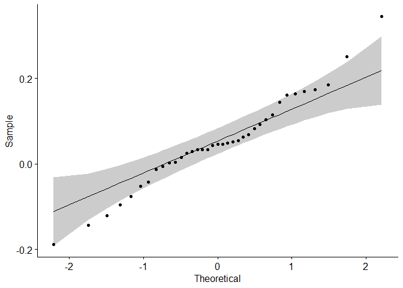
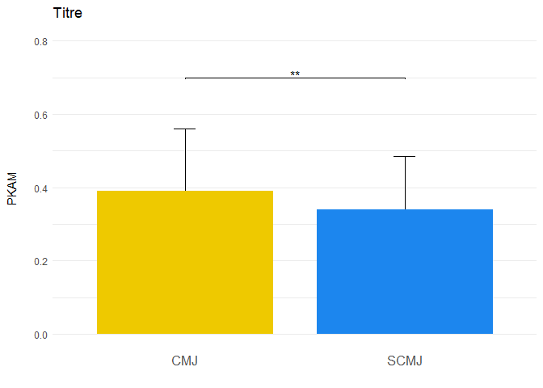
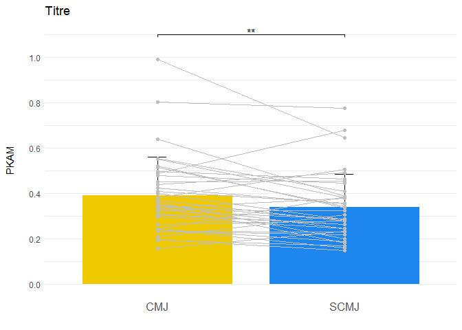

Test t de Student pour échantillons appariés
================
Thomas Flocquet

##### **Existe-t-il une différence statistiquement significative entre les valeurs moyennes de deux groupes dépendants?**

*Exemple:* Existe-t-il une différence statistiquement significative
entre les deux groupes CMJ et SCMJ au niveau du PKAM?

Hypothèses du test:

**H0** (hypothèse nulle): Il n’y a pas de différence significative entre
les moyennes des deux groupes dépendants.

*Exemple:* Il n’y a pas de différence significative du PKAM entre les
deux groupes.

**H1** (hypothèse alternative): Il existe une différence significative
entre les moyennes des deux groupes dépendants.

*Exemple:* Il y a une différence significative du PKAM entre les deux
groupes.

### Fonctionnement du test

Le test t pour échantillons appariés est utilisé pour comparer les
moyennes de deux groupes dépendants, c’est à dire des groupes dans
lesquels chaque observation d’un groupe a un correspondant direct dans
l’autre groupe (par exemple un sujet qui a une donnée dans chacun des 2
groupes). Ce test évalue si la différence moyenne entre ces paires de
données est significativement différente de zéro. Pour ce faire, il
calcule la différence entre chaque paire, puis utilise la moyenne et
l’écart-type de ces différences pour déterminer la statistique de test.

### Packages

``` r
# Pour installer un package si nécessaire, install.packages("readxl")
library(readxl)
library(dplyr)
library(rstatix)
library(ggplot2)
library(ggpubr)
```

  

### Données

``` r
# Importation des données
data <- read_xlsx("data_t_test_appariées.xlsx")
# Mise de la variable en facteur pour spécifier que c'est une variable qualitative.
data$Conditions <- as.factor(data$Conditions)
head(data, 10)
```

    ## # A tibble: 10 × 3
    ##       ID Conditions  pKAM
    ##    <dbl> <fct>      <dbl>
    ##  1     1 CMJ        0.346
    ##  2     2 CMJ        0.242
    ##  3     3 CMJ        0.804
    ##  4     4 CMJ        0.554
    ##  5     5 CMJ        0.400
    ##  6     6 CMJ        0.323
    ##  7     7 CMJ        0.383
    ##  8     8 CMJ        0.326
    ##  9     9 CMJ        0.450
    ## 10    10 CMJ        0.306

 

### Statistiques descriptives

``` r
# Statistiques descriptives pour chaque condition: nombre d'observations, moyennes, écart-types
stat_desc <- data %>% group_by(Conditions) %>% get_summary_stats(pKAM, type = "mean_sd")
stat_desc
```

    ## # A tibble: 2 × 5
    ##   Conditions variable     n  mean    sd
    ##   <fct>      <fct>    <dbl> <dbl> <dbl>
    ## 1 CMJ        pKAM        37  0.39 0.171
    ## 2 SCMJ       pKAM        37  0.34 0.144

  

### Normalité

Le test de normalité s’effectue sur la différence des paires dans le cas
des échantillons appariés.

``` r
# Séparation par condition
CMJ <- data %>% filter(Conditions %in% c("CMJ"))
SCMJ <- data %>% filter(Conditions %in% c("SCMJ"))
# Différence des deux conditions pour chaque paire
difference <- CMJ %>% select(-ID,-Conditions) - SCMJ %>% select(-ID,-Conditions)
head(difference, 10)
```

    ##            pKAM
    ## 1   0.163958556
    ## 2   0.053858748
    ## 3   0.029653257
    ## 4   0.144941785
    ## 5   0.114990684
    ## 6   0.033887504
    ## 7  -0.121496775
    ## 8   0.003161168
    ## 9  -0.005583502
    ## 10  0.043281537

``` r
# Test de normalité sur les données différence
test_normalité <- difference %>% shapiro_test(pKAM)
test_normalité
```

    ## # A tibble: 1 × 3
    ##   variable statistic     p
    ##   <chr>        <dbl> <dbl>
    ## 1 pKAM         0.975 0.553

*Interprétation du test de normalité:*  
- p\>0.05: les données suivent la loi normale et il est possible de
faire le test t.  
- p\<0.05: les données ne suivent pas la loi normale et il faut
effectuer un test non paramétrique (le *test de Wilcoxon pour
échantillons appariés*).

``` r
# ggplot qui permet de voir les données qui s'éloigne de la loi normale
ggqqplot(difference, x = "pKAM")
```

<!-- -->  

### T test

``` r
#  t test avec le paramètre qui spécifie le caractère apparié des données, add_significance() rajoute la colonne p.signif
test <- data %>% t_test(pKAM~Conditions, paired = TRUE) %>% add_significance()
test
```

    ## # A tibble: 1 × 9
    ##   .y.   group1 group2    n1    n2 statistic    df       p p.signif
    ##   <chr> <chr>  <chr>  <int> <int>     <dbl> <dbl>   <dbl> <chr>   
    ## 1 pKAM  CMJ    SCMJ      37    37      2.83    36 0.00757 **

  

*Interprétation du t test:*  
- p\>0.05: L’hypothèse nulle n’est pas rejetée, il n’y a pas de
différence significative entre les deux groupes.  
- p\<0.05: L’hypothèse nulle est rejetée, il y a une différence
significative entre les deux groupes.

Dans notre cas p=0.00757, il y a une différence significative entre les
deux groupes.

### Taille d’effet (d de Cohen)

Le d de Cohen est une mesure de la taille de l’effet utilisée pour
évaluer l’ampleur de la différence entre les deux moyennes dans le
contexte d’un test t pour échantillons appariés. Il est calculé en
divisant la différence moyenne des paires par l’écart-type des
différences des paires. Cette mesure permet de quantifier la taille de
l’effet indépendamment de la taille de l’échantillon, offrant ainsi une
interprétation de la signification pratique de la différence observée.

``` r
# Taille d'effet avec le paramètre paired qui spécifie le caractère apparié des données
taille_effet <- data %>% cohens_d(pKAM~Conditions, paired = TRUE)
taille_effet
```

    ## # A tibble: 1 × 7
    ##   .y.   group1 group2 effsize    n1    n2 magnitude
    ## * <chr> <chr>  <chr>    <dbl> <int> <int> <ord>    
    ## 1 pKAM  CMJ    SCMJ     0.465    37    37 small

Un d de Cohen de 0.2 est généralement considéré comme un petit effet,
0.5 comme un effet moyen, et 0.8 ou plus comme un grand effet.

Dans notre cas d=0.46, on a ainsi un petit effet voire un effet moyen.

### Graphique (barplot)

Pour rapporter les résultats, il est important de spécifier les moyennes
et écart-type ainsi que les résultats du test. Ceci peut être fait à
l’aide d’un tableau mais également d’un graphique.

``` r
# Pour spécifier l'ordre des barres
data$Conditions <- factor(data$Conditions, levels = c("CMJ","SCMJ"))
stat_desc$Conditions <- factor(stat_desc$Conditions, levels = c("CMJ","SCMJ"))

# add_xy_position() donne la position de la barre contenant les étoiles
test <- test %>% add_xy_position(fun = "mean_sd", x = "Conditions")
# ici seulement les tests significatifs sont gardés
test_signif <- subset(test, p.signif != "ns")

# y_positions permet de modifier la position de la barre sur l'axe des ordonnées
y_positions <- 0.7
test_signif$y.position <- y_positions


graphique <- ggplot(data = stat_desc) +
  
  # Ajout des barres
  geom_bar(aes(x = Conditions, y = mean, fill = Conditions), stat = "identity", position = position_dodge(), width = 0.8) +
  
  # Ajout des deux barres verticales qui donnent l'écart-type
  geom_linerange(aes(x = Conditions, ymin = mean, ymax = mean + sd), position = position_dodge()) +
  # Ajout des deux barres au dessus des écart-types
  geom_segment(aes(x = as.numeric(Conditions) - 0.05, xend = as.numeric(Conditions) + 0.05, y = mean + sd, yend = mean + sd), 
               position = position_dodge()) +
  
  theme_minimal() +
  # Dans theme() il est possible de spécifier beaucoup de paramètres comme sur les titres, les légendes, la grille de fond, ...
  theme(legend.position = "none",
        axis.title.y = element_text(margin = margin(r = 15), hjust = 0.5),
        axis.text.x = element_text(size = 12), 
        panel.grid.major.x = element_blank()) +
  
  # Spécifie les graduations et la taille de l'axe des ordonnées avec limits
  scale_y_continuous(breaks = seq(0, 1, by = 0.2), limits = c(0,0.8)) +
  
  # Couleurs
  scale_fill_manual(values = c("gold2", "dodgerblue2")) +
  
  # Ajout de la barre avec la significativité
  stat_pvalue_manual(test_signif, label = "p.signif", tip.length = 0.01) +
  
  # Titre des axes
  ylab("PKAM") +
  xlab("") +
  
  # Titre du graphique
  labs(title="Titre")

graphique
```

<!-- -->  
Lorque cela est visible, il est possible de rajouter les lignes reliant
les points de chaque sujet.

``` r
# Pour spécifier l'ordre des barres
data$Conditions <- factor(data$Conditions, levels = c("CMJ","SCMJ"))
stat_desc$Conditions <- factor(stat_desc$Conditions, levels = c("CMJ","SCMJ"))

# add_xy_position() donne la position de la barre contenant les étoiles
test <- test %>% add_xy_position(fun = "mean_sd", x = "Conditions")
# ici seulement les tests significatifs sont gardés
test_signif <- subset(test, p.signif != "ns")

# y_positions permet de modifier la position de la barre sur l'axe des ordonnées
y_positions <- 1.1
test_signif$y.position <- y_positions

graphique <- ggplot(data = stat_desc) +
  
  # Ajout des barres
  geom_bar(aes(x = Conditions, y = mean, fill = Conditions), stat = "identity", position = position_dodge(), width = 0.8) +
  
  # Ajout des deux barres verticales qui donnent l'écart-type
  geom_linerange(aes(x = Conditions, ymin = mean, ymax = mean + sd), position = position_dodge()) +
  # Ajout des deux barres au dessus des écart-types
  geom_segment(aes(x = as.numeric(Conditions) - 0.05, xend = as.numeric(Conditions) + 0.05, y = mean + sd, yend = mean + sd), 
               position = position_dodge()) +
  
  # Ajout des points reliés par paires
  geom_point(data = data, aes(x = Conditions, y = pKAM, group = ID), color = "grey") +
  geom_line(data = data, aes(x = Conditions, y = pKAM, group = ID), color = "grey") +
  
  theme_minimal() +
  # Dans theme() il est possible de spécifier beaucoup de paramètres comme sur les titres, les légendes, la grille de fond, ...
  theme(legend.position = "none",
        axis.title.y = element_text(margin = margin(r = 15), hjust = 0.5),
        axis.text.x = element_text(size = 12), 
        panel.grid.major.x = element_blank()) +
  
  # Spécifie les graduations et la taille de l'axe des ordonnées avec limits
  scale_y_continuous(breaks = seq(0, 1, by = 0.2), limits = c(0,1.1)) +
  
  # Couleurs
  scale_fill_manual(values = c("gold2", "dodgerblue2")) +
  
  # Ajout de la barre avec la significativité
  stat_pvalue_manual(test_signif, label = "p.signif", tip.length = 0.01) +
  
  # Titre des axes
  ylab("PKAM") +
  xlab("") +
  
  # Titre du graphique
  labs(title="Titre")

graphique
```

<!-- -->

``` r
# Exportation du graphique au format png
ggsave("mon_graphique.png", plot = graphique, width = 10, height = 10, units = "cm", bg = "white")
```
